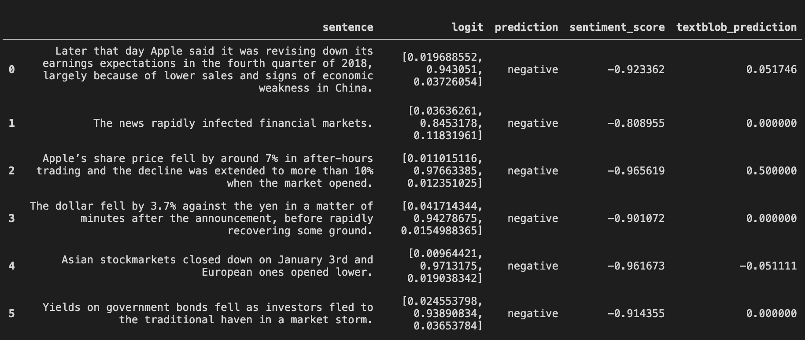
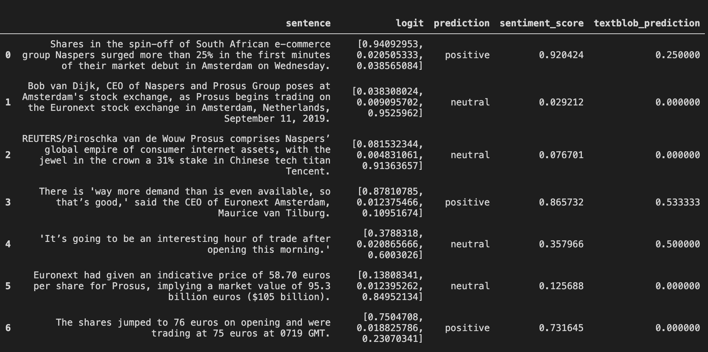

# Transformers_FinancialNews_Sentiment
Fine-tuning Transformers from HuggingFace for financials news sentiment

## Goal : Develop a specialized sentiment analyzer for financial news articles

There are two main types of sentiment analyzers:
1. Using sentiment-labelled word lists (i.e. dictionaries)
2. Using sentiment classifiers based on language models trained on huge corpora (IMDB, yelp reviews, etc.)

For domain-specific sentiment analysis, these latter language models tend to perform poorly. This is especially true for **Financial sentiment analysis**. [This medium article](https://towardsdatascience.com/a-new-way-to-sentiment-tag-financial-news-9ac7681836a7) explains this difference far better than I could here, so please check it out. 

Within finance, those trying to build on open-source resources will likely end up with Notre Dame’s McDonald- Loughran (M-L) word lists, which were created by analysing over fifty thousand earnings reports over the 1994–2008 period. This dictionary has been used by, among others, Google, Fidelity, Citadel, Dow Jones, and S&P Global. However, this "bag-of- words" approach or lexicon-based method in which a dictionary of financial terms is created with values such as "positive" or "uncertain" come short in analyzing deeper semantic meaning of a given text.

Transformers LM & NLP transfer learning methods offer a better solution. These language models are trained on very large corpora and we then use their representations and fine tune initializing down-stream models with the weights learned from the language modeling task. The initialized layers can range from the single word embedding layer to the whole model. In our case we will use the entire model and add a classifier on the top for determining sentiment.

## Data

Here is some information on the dataset used to fine-tune BERT model for financial news sentiment

- Financial Phrasebank consists of 4845 english sentences selected randomly from financial news found on LexisNexis database. These sentences then were annotated by 16 people with background in finance and business. The annotators were asked to give labels according to how they think the information in the sentence might affect the mentioned company stock price. The dataset also includes information regarding the agreement levels on sentences among annotators.
- The dataset can be found here: https://www.researchgate.net/publication/251231364_FinancialPhraseBank-v10

## Results

Here I compare the sentiment scores from the fine-tuned BERT model to the out of the box TextBlob sentiment analyzer

With the predict function, given a piece of text, we split it into a list of sentences and then predict sentiment for each sentence. The output is written into a dataframe. Predictions are represented in three different columns:

1) logit: probabilities for each class
2) prediction: predicted label
3) sentiment_score: sentiment score calculated as: probability of positive - probability of negative

Below we analyze a paragraph taken out of [this article from The Economist](https://www.economist.com/finance-and-economics/2019/01/03/a-profit-warning-from-apple-jolts-markets). For comparison purposes, we also put the sentiments predicted with TextBlob.

`Later that day Apple said it was revising down its earnings expectations in the fourth quarter of 2018, largely because of lower sales and signs of economic weakness in China. The news rapidly infected financial markets. Apple’s share price fell by around 7% in after-hours trading and the decline was extended to more than 10% when the market opened. The dollar fell by 3.7% against the yen in a matter of minutes after the announcement, before rapidly recovering some ground. Asian stockmarkets closed down on January 3rd and European ones opened lower. Yields on government bonds fell as investors fled to the traditional haven in a market storm.`

Here is another example

